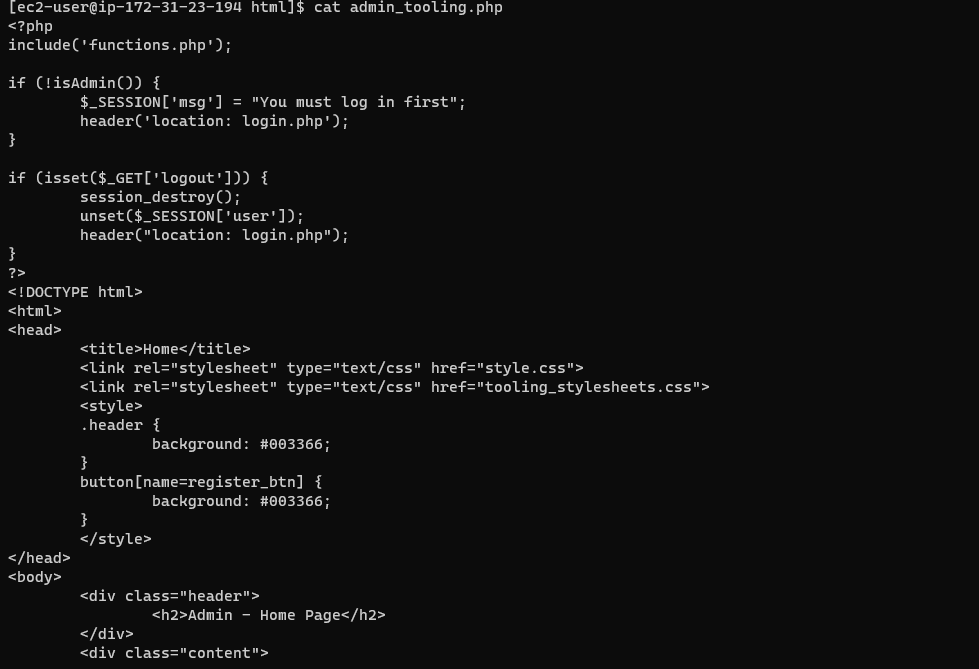
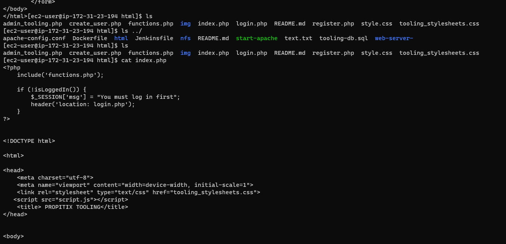
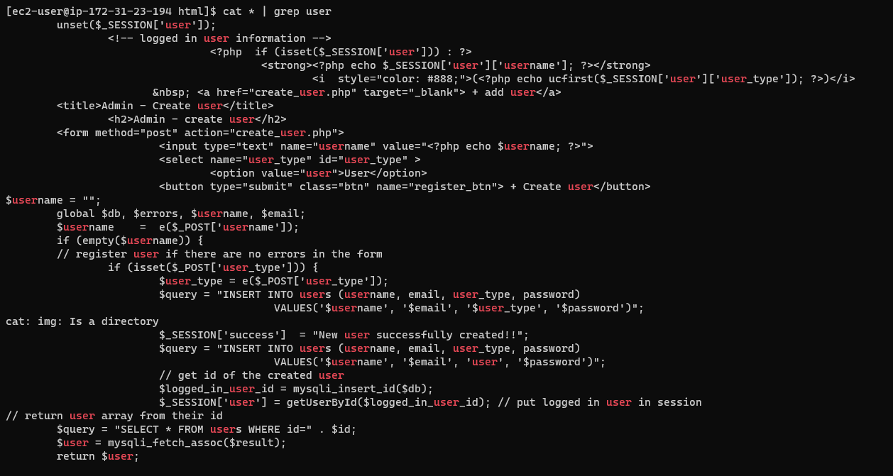
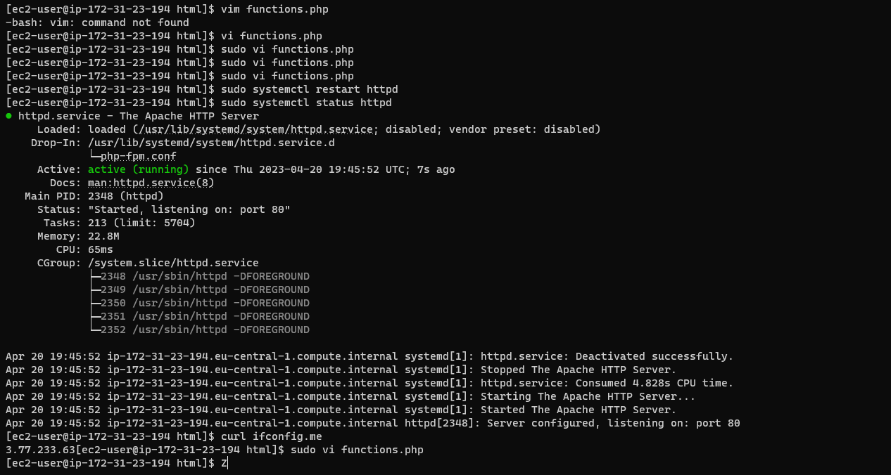
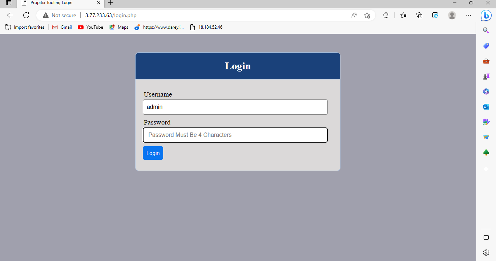

#  PREPARE NFS SERVER 

Start by providing an overview of the NFS server. Include information such as the purpose of the server, the version of NFS being used, and the operating system on which the NFS server is installed.
List the hardware and software requirements for the NFS server. This should include the minimum and recommended hardware specifications, as well as the software dependencies required for the NFS server to function properly.
Provide detailed instructions on how to install and configure the NFS server. This should include steps such as installing the NFS server software, creating a directory to share, setting permissions for the shared directory, configuring exports, restarting the NFS server, and configuring the firewall.
Provide instructions on how to configure clients to access the NFS server. This should include steps such as installing the NFS client software, mounting the shared directory on the client, and configuring the client firewall to allow NFS traffic.
Include a section on troubleshooting common issues with the NFS server. This should include issues such as permissions problems, firewall issues, and network connectivity problems.
Include information on how to maintain the NFS server. This should include regular maintenance tasks such as monitoring server performance, backing up data, and updating software.
Include a section on how to secure the NFS server. This should include steps such as configuring user authentication, setting permissions on shared directories, and configuring the firewall to allow only trusted clients to access the server.
Conclusion:
Conclude the documentation with a summary of the key points covered in the document. Provide any additional resources that may be helpful for users, such as links to online forums, documentation, or support channels.

## the result i got while doing project 7

